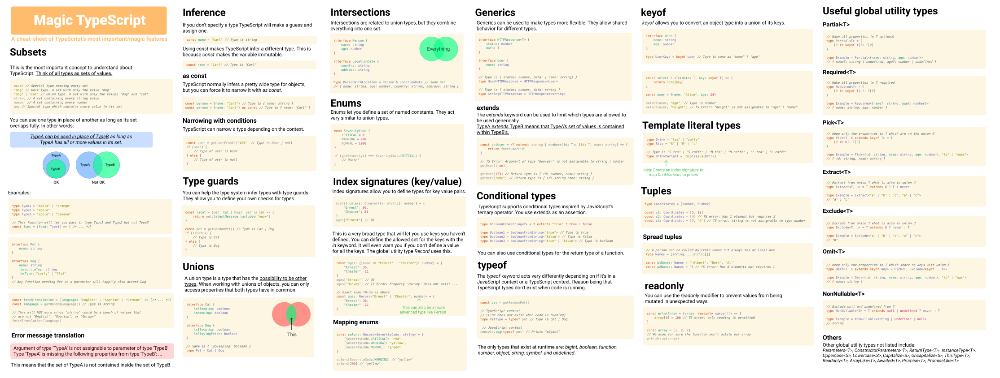

<h1 align="center">🪄 Magic TypeScript 🪄</h1>

A cheat-sheet of TypeScript’s most important/magic features

# The cheat-sheet

[Click here to view it in full size]()

# Source

[This is](source.fig) the Figma file.

# Issues

I may have made a mistake or two. If you find one, feel free to open an issue on this repository, and I will fix it.

# License

This project is licensed under the MIT License - see the [LICENSE](LICENSE) file for details
