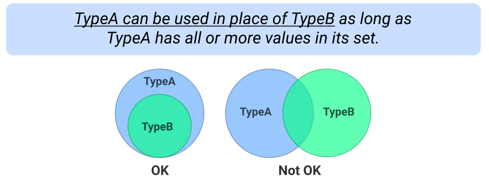
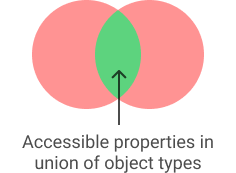
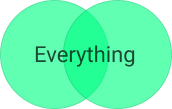

# Magic TypeScript

**A cheat sheet of TypeScript’s most important/magic features**

# Subsets

This is the most important concept to understand about TypeScript. Think of all types as sets of values.

```ts
never; // Special type meaning empty set
("dog"); // Unit type. A set with only the value "dog"
"dog" | "cat"; // Union type. A set with only the values "dog" and "cat"
string; // A set containing every string value
number; // A set containing every number
any; // Special type which contains every value in its set
```

You can use one type in place of another as long as its set overlaps fully. In other words:



Examples:

```ts
type Type1 = "apple" | "orange";
type Type2 = "apple";
type Type3 = "apple" | "banana";

const func = (food: Type1) => {
  /* ... */
};
// This function will let you pass in type Type1 and Type2 but not Type3
```

```ts
interface Pet {
  name: string;
}

interface Dog {
  name: string;
  favouriteToy: string;
  furType: "curly" | "flat";
}
// Any function needing Pet as a parameter will happily also accept Dog
```

```ts
const fetchTranslation = (language: "English" | "Spanish" | "German") => {
  /* ... */
};
const language = getRandomLanguage(); // Type is string
fetchTranslation(language);
// This does NOT work since 'string' could be a bunch of values that
// are not "English", "Spanish", or "German"
```

### Error message translation


This means that the set of TypeA is not contained inside the set of TypeB.

# Inference

If you don't specify a type TypeScript will make a guess and assign one.

```ts
let name = "Carl"; // Type is string
```

Using _const_ makes TypeScript infer a different type. This is because _const_ makes the variable immutable.

```ts
const name = "Carl"; // Type is "Carl"
```

### as const

TypeScript normally infers a pretty wide type for objects, but you can force it to narrow it with _as const._

```ts
const person = { name: "Carl" }; // Type is { name: string }
const person = { name: "Carl" } as const; // Type is { name: "Carl" }
```

### Narrowing with conditions

TypeScript can narrow a type depending on the context.

```ts
const user = getUserFromId("123"); // Type is User | null
if (user) {
  // Type of user is User
} else {
  // Type of user is null
}
```

# Type guards

You can help the type system infer types with type guards. They allow you to define your own checks for types.

```ts
const isCat = (pet: Cat | Dog): pet is Cat => {
  return pet.latestMessage.includes("meow");
};

const pet = getRandomPet(); // Type is Cat | Dog
if (isCat(pet)) {
  // Type is Cat
} else {
  // Type is Dog
}
```

# Unions

A union type is a type that has the possibility to be other types. When working with unions of objects, you can only access properties that both types have in common.



```ts
interface Cat {
  isSleeping: boolean;
  isMeowing: boolean;
}

interface Dog {
  isSleeping: boolean;
  isPlayingFetch: boolean;
}

// Same as { isSleeping: boolean }
type Pet = Cat | Dog;

const dog: Pet = getRandomDog(); // OK
```

# Intersections

Intersections are related to union types, but they combine everything into one set.



```ts
interface Person {
  name: string;
  age: number;
}

interface LocationData {
  country: string;
  address: string;
}

type PersonWithLocation = Person & LocationData; // Same as:
// { name: string, age: number, country: string, address: string }

// TS Error: Type Person is missing: country, address
const person: PersonWithLocation = getRandomPerson();
```

# Enums

Enums let you define a set of named constants. They act very similar to union types.

```ts
enum SeverityCode {
	CRITICAL = 0
	WARNING = 200
	NORMAL = 1000
}

if (getSeverity() === SeverityCode.CRITICAL) {
	// Panic!
}
```

This is a very broad type that will let you use keys you haven't defined. You can define the allowed set for the keys with the _in_ keyword. It will even warn you if you don't define a value for all the keys. The global utility type _Record_ uses this.

```ts
const ages: { [name in "Ernest" | "Chester"]: number } = {
  Ernest: 36,
  Chester: 21,
};
ages["Ernest"]; // 36
ages["Harvey"]; // TS Error: Property 'Harvey' does not exist ...

// Exact same thing as above
const ages: Record<"Ernest" | "Chester", number> = {
  Ernest: 36,
  Chester: 21,
};
```

# Index signatures (key/value)

Index signatures allow you to define types for key value pairs.

```ts
const ages: { [name: string]: number } = {
  Ernest: 36,
  Chester: 21,
};
ages["Ernest"]; // 36
```

This is a very broad type that will let you use keys you haven't defined. You can define the allowed set for the keys with the _in_ keyword. It will even warn you if you don't define a value for all the keys. The global utility type _Record_ uses this.

```ts
const ages: { [name in "Ernest" | "Chester"]: number } = {
  Ernest: 36,
  Chester: 21,
};
ages["Ernest"]; // 36
ages["Harvey"]; // TS Error: Property 'Harvey' does not exist ...

// Exact same thing as above
const ages: Record<"Ernest" | "Chester", number> = {
  Ernest: 36,
  Chester: 21,
};
```

### Mapping enums

```ts
const colors: Record<SeverityCode, string> = {
  [SeverityCode.CRITICAL]: "Red",
  [SeverityCode.WARNING]: "yellow",
  [SeverityCode.NORMAL]: "green",
};

colors[SeverityCode.WARNING]; // "yellow"
colors[200]; // "yellow"
```

# Generics

Generics can be used to make types more flexible. They allow shared behavior for different types.

```ts
interface HTTPResponse<T> {
  status: number;
  data: T;
}

interface User {
  name: string;
}

// Type is { status: number, data: { name: string} }
type UserHTTPResponse = HTTPResponse<User>;

// Type is { status: number, data: string }
type StringHTTPResponse = HTTPResponse<string>;
```

### extends

The extends keyword can be used to limit which types are allowed to be used generically.

TypeA extends TypeB means that TypeA's set of values is contained within TypeB's.

```ts
const getUser = <T extends string | number>(id: T): { id: T; name: string } => {
  return fetchUser(id);
};

// TS Error: Argument of type 'boolean' is not assignable to string | number
getUser(true);

getUser(123); // Return type is { id: number, name: string }
getUser("abc"); // Return type is { id: string, name: string }
```

# Conditional types

TypeScript supports conditional types inspired by JavaScript's ternary operator. You use _extends_ as an assertion.

```ts
type BooleanFromString<T> = T extends "true" ? true : false;

type Boolean1 = BooleanFromString<"true">; // Type is true
type Boolean2 = BooleanFromString<"false">; // Type is false
type Boolean3 = BooleanFromString<"true" | "false">; // Type is boolean
```

You can also use conditional types for the return type of a function.

# typeof

The _typeof_ keyword acts very differently depending on if it's in a JavaScript context or a TypeScript context. Reason being that TypeScript types don't exist when code is running.

```ts
const pet = getRandomPet();

// TypeScript context
// (Line does not exist when code is running)
type PetType = typeof pet; // Type is Cat | Dog

// JavaScript context
console.log(typeof pet); // Prints "object"
```

The only types that exist at runtime are: `bigint, boolean, function, number, object, string, symbol, undefined.`

# keyof

_keyof_ allows you to convert an object type into a union of its keys.

```ts
interface User {
  name: string;
  age: number;
}

type UserKeys = keyof User; // Type is same as "name" | "age"
```

```ts
const select = <T>(data: T, key: keyof T) => {
  return data[key];
};

const user = { name: "Alice", age: 24 };

select(user, "age"); // Type is number
select(user, "height"); // TS Error: "height" is not assignable to "age" | "name"
```

# Template literal types

```ts
type Drink = "tea" | "coffee";
type Size = "S" | "M" | "L";

// Type is "S-tea" | "S-coffee" | "M-tea" | "M-coffee" | "L-tea" | "L-coffee"
type DrinkVariant = `${Size}-${Drink}`;
```

Idea: Create an Index signature to map DrinkVariants to prices

# Tuples

```ts
type Coordinates = [number, number];

const c1: Coordinates = [5, 12];
const c2: Coordinates = [4]; // TS error: Has 1 element but requires 2
const c3: Coordinates = [7, "9"]; // TS error: string is not assignable to type number
```

### Spread tuples

```ts
// A person can be called multiple names but always has at least one
type Names = [string, ...string[]];

const p1Names: Names = ["Albert", "Bert", "Al"];
const p2Names: Names = []; // TS error: Has 0 elements but requires 1
```

# readonly

You can use the _readonly_ modifier to prevent values from being mutated in unexpected ways.

```ts
const printArray = (array: readonly number[]) => {
  array[0] = 100; // TS error: only reading is permitted
};

const array = [1, 2, 3];
// We know for sure the function won't mutate our array
printArray(array);
```

# Useful global utility types

**Partial<T>**

```ts
// Make all properties in T optional
type Partial<T> = {
  [P in keyof T]?: T[P];
};

type Example = Partial<{ name: string; age: number }>;
// { name?: string | undefined, age?: number | undefined }
```

**Required<T>**

```ts
// Make all properties in T required
type Required<T> = {
  [P in keyof T]-?: T[P];
};

type Example = Required<{ name?: string; age?: number }>;
// { name: string, age: number }
```

**Pick<T>**

```ts
// Keep only the properties in T which are in the union K
type Pick<T, K extends keyof T> = {
  [P in K]: T[P];
};

type Example = Pick<{ id: string; name: string; age: number }, "id" | "name">;
// { id: string, name: string }
```

**Extract<T>**

```ts
// Extract from union T what is also in union U
type Extract<T, U> = T extends U ? T : never;

type Example = Extract<"a" | "b" | "c", "a" | "c">;
// "a" | "c"
```

**Exclude<T>**

```ts
// Exclude from union T what is also in union U
type Exclude<T, U> = T extends U ? never : T;

type Example = Exclude<"a" | "b" | "c", "a" | "c">;
// "b"
```

**Omit<T>**

```ts
// Keep only the properties in T which share no keys with union K
type Omit<T, K extends keyof any> = Pick<T, Exclude<keyof T, K>>;

type Example = Omit<{ id: string; name: string; age: number }, "id" | "age">;
// { name: string }
```

**NonNullable<T>**

```ts
// Exclude null and undefined from T
type NonNullable<T> = T extends null | undefined ? never : T;

type Example = NonNullable<string | undefined | null>;
// string
```

**Others**

Other global utility types not listed include:

```
Parameters<T>, ConstructorParameters<T>, ReturnType<T>, InstanceType<T>, Uppercase<S>, Lowercase<S>, Capitalize<S>, Uncapitalize<S>, ThisType<T>, Readonly<T>, ArrayLike<T>, Awaited<T>, Promise<T>, PromiseLike<T>
```
